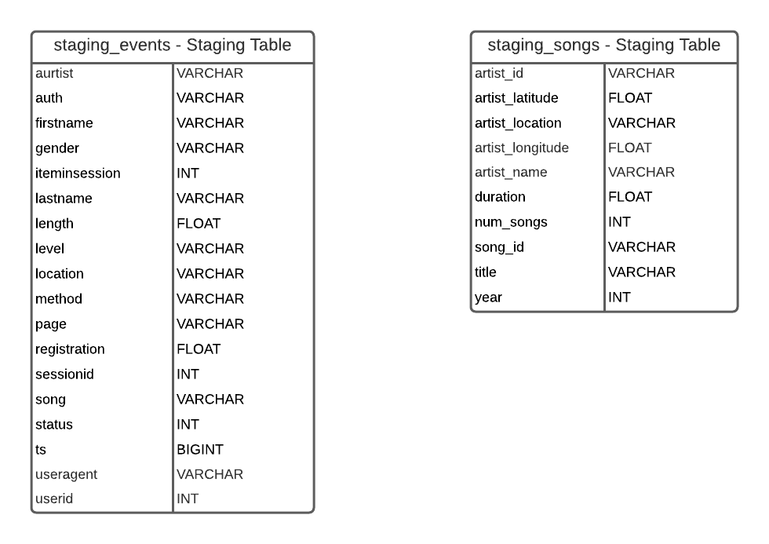
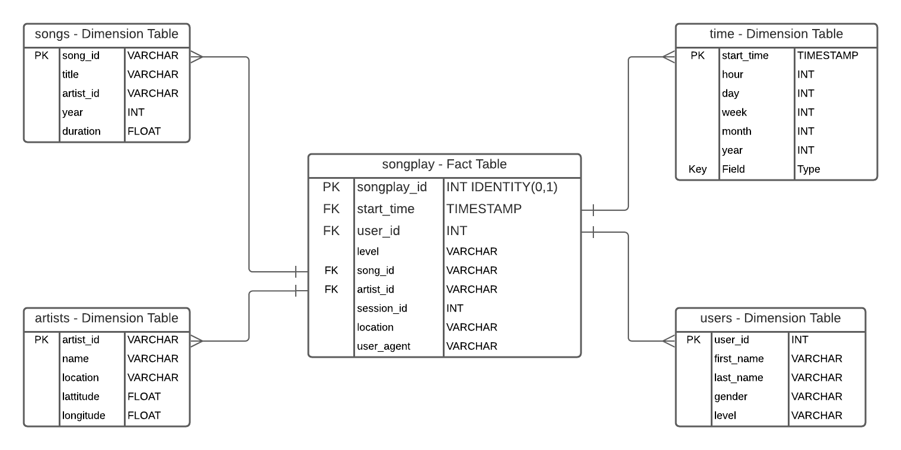

# Project 3: Data Warehouse using Amazon Redshift

### Introduction

The purpose of this project is to create a cloud based Data Warehouse to store data from the Sparkify app in order to enable the analytics team to gain insights into the songs that Sparkify users are listening to.  Song data and log data are stored in S3 using JSON format.  An ETL pipeline is used to ingest song data and log data from the JSON files in the 'song_data' and 'log_data' folders in S3 into staging tables.  From the staging tables, the data is then transformed and loaded into the fact and dimension tables for analytics by the Sparkify analytics team.

### Project Files

**README.md** - The current document that is being read.  Provides a project overview, and gives instructions.  

**dwh.cfg** - Configuration file the stores connection information for the database once created, the ARN for the IAM role and paths to the data in the S3 bucket.  
**IMPORTANT NOTE: Remove passwords and sensitive information from dwh.cfg before sharing.**  

**sql_queries.py** - Contains the queries for dropping tables, creating the staging tables, creating the fact dimension tables, the ETL pipline from the S3 bucket to the staging tables and ETL pipeline from the staging tables to the fact and dimension tables.  

**create_tables.py** - This file contains the code for running the queries defined in the sql_queries.py file for creating the tables that store the data from Sparkify.  

**etl.py** -  This file contains the code for running the queries defined in the sql_queries.py file for the ETL pipeline that first loads data from the S3 bucket to the staging tables and then from the staging tables to the fact/dimension tables.  

**Sparkify_DWH_ER_Diagram.png** - This is a PNG image containing the ER Diagram for the Sparkify Data Warehouse.  It is embedded into the README.md Markdown file.  

**Sparkify_Staging_table_definitions.png** - This is a PNG image file containing the definition of the Staging Tables.  

**redshiftcreator.ipynb** - Jupyter notebook used for setting up IAM role and creating redshift cluster and then deleting IAM role and redshift cluster for the Sparkify DWH project.  

**redshiftcreator.cfg** - Configuration file for redshiftcreator.ipynb.  This stores information used in the creation of an IAM role and a redshift cluster.
**IMPORTANT NOTE: Remove the Access KEY, Secret KEY, password and any other sensitive information before sharing**.  

**analytics_samples.ipynb** - Contains sample queries to analyze data in the Data Warehouse for Sparkify.  

### Staging Table Definitions

The song data and log data are loaded into the staging_songs and staging_events tables respectively from the S3 bucket.  From here, the data is loaded into the Sparkify Data Warehouse Fact and Dimension tables.

### Fact/Dimension Table Definitions

For the Sparkify Data Warehouse, a KEY Distribution Style was chosen for the songplay Fact Table to anticipate the growth of the data set as more records are generated from more user events.  The KEY Distribution Style splits up the table on the distribution key among nodes.  The start_time was selected as the distribution key for songplay Fact Table as the data is event driven.  The dimension tables have their primary keys set as sortkeys to help optimize analytics queries.

### ETL Process

After the Staging Tables and Fact/Dimension Tables are created the data is loaded into the Sparkify Data Warehouse from the S3 bucket.  The data for the project in the S3 bucket is in JSON format.

1. User event data is ingested into the staging_events table using the copy command from the log_data folder in the S3 bucket.  The format for the import is stored in the log_json_path.json file.

2. Song data is ingested into the staging_songs table using the copy command from the song_data folder in the S3 bucket.

3. The songplay Fact Table is populated from the staging_events and staging_songs tables using an SQL to SQL ETL pipeline.  Similar to project one, the data is filtered for records where 'NextSong, is in the staging_events table and the timestamp is converted from milliseconds while being converted from an integer data type to a timestamp data type before getting loaded into the songplay table.  The join is done on artist name and song title between the staging_events and staging_songs tables to populate the songplay table.

4. The users Dimension Table is loaded from the staging_events table for all records where the user id is not null.  Per Udacity Knowledge Base Article 276119, the idea to add records for user ids not previously added in reverse order by timestamp was borrowed from Erick H. and is intended to help with avoiding stale data as subscription level changes.

5. The songs Dimension Table is loaded from the staging_songs table for all records where the song id is not null.  The select statement in the insert statement is setup to exclude entering records where song id is already in the songs table to avoid duplicates.

6. The artists Dimension Table is loaded from the staging_songs table for all records where the artist id is not null.  The select statement in the insert statement is setup to exclude entering records where artist id is already in the artists table to avoid duplicates.

7. The time Dimension Table is loaded from the staging_events table for all records where there is a timestamp.  The timestamp is converted from milliseconds and transformed into a timestamp data type from an integer data type before loading into the time table.  The Extact function is used to get hour, day, week, month, year and day of week from the timestamp for placement into the time table.  The select statement in the insert statement is setup to exclude entering records where start_time is already in the time table to avoid duplicates.

### Instructions for Running Project

1.  Open the redshiftcreator.cfg file and fill in the configuration information for each of the variables, Step 0 in the reshiftcreator.ipynb file gives instuctions on how to setup the admin role before getting the access key and the secret key that will be needed for the redshiftcreator.cfg file.  

2. Run steps 1 thru 4 in the redshiftcreator.ipynb notebook to create the IAM role and the redshift cluster.  The instuctions for doing this are in the redshifcreator.ipynb file and should be followed carefully.  **NOTE: Do not run Step 5 until done working with the project.**  

3. Open the dwh.cfg file and fill in the configuration information for the project under [CLUSTER] and [IAM_ROLE].  Everything you should need is available from the prior step.

4. Open a terminal and run `python create_tables.py` to create the tables needed for the Sparkify Data Warehouse project.

5. After the tables are created, run `python etl.py` to load data into the tables.

6. Open the analytics_samples.ipynb notebook to run sample analytics for the project in order to get a basic idea of how it works.

7. After working with the project, go back to the redshiftcreator.cfg file and follow the instructions under Step 5 to do clean up.
